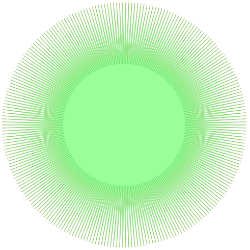
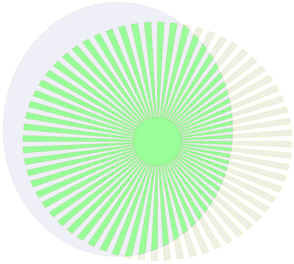
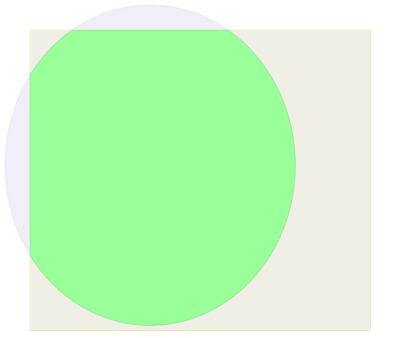

# 基于树的多边形裁减算法

TreeClip是一种基于树的多边形裁剪算法，将多边形顶点划分为不同部分，计算不同部分的最小旋转包围框（RBOX），并将其按照由粗到精的方式组织为树状结构。从顶层向下遍历两棵树，比较两棵树的节点是否相交，只有相交的节点才会进入下一层遍历，这样能够尽量在顶层就排除不相交的节点，从而减少对多边形边的相交判断。

## 算法实现

为了比较本算法与Vatti（1992）算法、Greiner和Hormann（1998）算法及Martinez（2013）的性能，借鉴Angus Johnson的benchmarks[代码](http://www.angusj.com/delphi/clipper_cpp_benchmarks.zip)，使用C++实现了本算法，以及Greiner和Hormann算法，Martinez算法借用了Martinez论文代码。下载代码之后通过VisualStuido 2015（或者以上版本）打开工程，可以直接编译生成可执行程序。

## 测试数据

Angus Johnson的benchmarks中自带了测试数据，具体描述请访问[网站](http://www.angusj.com/delphi/clipper.php)。为了尽可能揭示顶点和交点个数的影响，排除其它因素，这里只使用了测试数据的裁剪/实体多边形的第一个简单多边形。

## 测试结果

测试机器配置: i3770 CPU+8G RAM
测试运行三个算法各100次的平均时间如下表：

### 表1 算法运行时间

| 测试数据              | 顶点个数     | 交点个数 | Vatti  | Greiner   | Martinez | 新算法    |
| --------------------- | ------------ | -------- | ------ | --------- | -------- | --------- |
| Classic               | 101242*46168 | 28       | 46.869 | 47077.211 | 188.432  | **5.638** |
| Overlap Stars         | 500*500      | 500      | 2.762  | 2.752     | 3.568    | **1.079** |
| Ellipses & Fan        | 109*256      | 66       | 0.257  | 0.344     | 0.797    | **0.116** |
| Ellipses & Rectangles | 109*4        | 4        | 0.048  | **0.021** | 0.110    | 0.03      |

### 输出结果
生成结果保存为svg格式，位于工程目录 `output` 下，可用浏览器查看。

以下是各个测试数据的具体结果，图中绿色表示裁剪后得到的多边形。

 
图1 Classic

 
图2 OverlapStars

 
 

 
图3 Ellipses & Fan

 
图4 Ellipses & Rectangles

